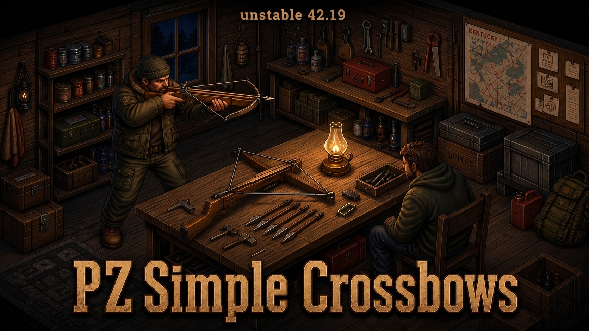

<p align="center">
  
</p>

# PZ Simple Crossbows

PZ Simple Crossbows is a standalone, lore-friendly crossbow pack for **Project Zomboid Build 42.19**. It adds practical craftable ranged weapons, handmade ammunition, custom models, icons, sounds, recipes, loot distribution, sandbox tuning, and English/Ukrainian localization.

[](https://steamcommunity.com/sharedfiles/filedetails/?id=3758880254)


## Features

- Four crossbow types with their own models, icons, balance, reload behavior, and use cases.
- Full wooden-bolt ammo chain: carve shafts, knap stone heads, assemble bolts, and reuse or recover what survives.
- Wilderness-friendly crafting with no magazine or book requirement.
- Standalone design: no extra framework mod required.
- Loot distribution for weapons and ammo, with sandbox multipliers for spawn rates.
- Multiplayer-safe bolt recovery from corpses.
- Custom sounds for shooting, reloading, dry fire, rack actions, and impact.
- English and Ukrainian localization included.

## Crossbows

| Weapon | Role | Notes |
|---|---|---|
| Crude Crossbow | Early survival weapon | Simple, rough, craftable from basic wood and binding. |
| Improved Crossbow | Reliable mid-tier option | Better range and accuracy, supports scopes. |
| Compound Crossbow | Heavy hitter | Strongest damage profile, slower reload, supports scopes. |
| Hand Crossbow | Compact repeater | One-handed sidearm that uses short bolts and holds four shots. |

## Ammunition

The mod adds a small survival crafting loop around wooden bolts:

- Carve **Wood Bolt Shafts** or **Short Wood Bolt Shafts** from branches, sticks, saplings, or planks.
- Make **Stone Bolt Heads** through flint knapping.
- Assemble **Wood Bolts** for full-size crossbows, or **Short Wood Bolts** for the hand crossbow.
- Recover fired bolts from corpses, with configurable break chances — recovered bolts can come back intact or as **Broken Bolts**, salvageable for materials.
- Bolts also come as **Box of Wood Bolts** / **Box of Short Wood Bolts** (a bundle of 10), found as loot or packed from loose bolts — open a box for 10 loose bolts, or bundle 10 loose bolts back into a box.
- **Bolt Quiver**: a wearable container that holds only wooden bolts (full and short). Wearing one grants +15% reload speed to all crossbows, the same bonus a shotgun shell bandolier gives a shotgun.

## Where to find it

Crossbows and bolts spawn as ordinary civilian loot — never in police or military loot pools:

- **Pawn shops**: weapon racks/lockers can hold any of the four crossbow tiers.
- **Gun stores and hunting/camping stores**: rifle racks and display cases carry Compound and Improved crossbows; ammo shelves carry boxes of bolts.
- **Army surplus stores**: rifle rack alongside the gun stores.
- **Ordinary houses**: closets, garages, living rooms, and storage units can turn up a crossbow or a box of bolts, same as any other hunting gear.
- **Survivor safehouses and caches**: full weapon roster, same spawn family vanilla firearms use.
- **Bars**: a Hand Crossbow and a box of short bolts can turn up under the counter, alongside the usual sawn-off shotguns.
- **Camping gear, crates, lockers, and wardrobes**: a rare chance at a Compound Crossbow as a bonus find.

A **Bolt Quiver** can turn up alongside the crossbows in every location above.

Crossbows, the quiver, and bolts can also be found while **foraging** outdoors (forests, farmland, town zones, trailer parks) — the same sandbox multipliers apply to both container loot and foraging spawns.

Spawn rates for each crossbow tier are tunable via the sandbox options below.

## Crafting

All recipes are available without books and are built around common survival materials:

- A real knife or sharp knife tag for carving and weapon assembly.
- Hammer for crossbow construction.
- Saw, nails, wire, planks, sticks, branches, saplings, and binding depending on the weapon tier.
- Carving, Maintenance, Woodwork, and Flint Knapping requirements scale with the item being made.
- **Crude Crossbow** adds 4 nails to the base wood-and-binding build.
- **Improved Crossbow** adds duct tape, scotch tape, or aramid thread for reinforcement.
- **Compound Crossbow** adds nuts & bolts for the pulley mechanism, plus a wrench as a required tool.
- **Hand Crossbow** adds electric wire, small carved handles, electronics scrap, and duct tape/scotch tape/aramid thread for its compact mechanism.
- **Bolt Quiver** is sewn instead of built: scissors, a sewing needle, and an awl (tools), plus 4 leather strips, heavy thread, and a buckle (consumed). Requires Tailoring 2.

## Item weights

| Item | Weight |
|---|---:|
| Crude Crossbow | 2.4 |
| Improved Crossbow | 2 |
| Compound Crossbow | 1.75 |
| Hand Crossbow | 1.45 |
| Wood Bolt Shaft | 0.05 |
| Short Wood Bolt Shaft | 0.03 |
| Crossbow Bolt Head | 0.1 |
| Wood Bolt | 0.08 |
| Short Wood Bolt | 0.05 |
| Wood Bolt (Broken) | 0.06 |
| Short Wood Bolt (Broken) | 0.03 |
| Box of Wood Bolts | 0.7 |
| Box of Short Wood Bolts | 0.4 |

## Sandbox options

| Option | Default | Range | Description |
|---|---:|---:|---|
| Overall Loot Spawn Multiplier | 1.0 | 0.0-1000.0 | Multiplies all mod container loot and foraging spawns; combines with the individual crossbow multipliers below. |
| Crude Crossbow Spawn Multiplier | 1.0 | 0.0-1000.0 | Container and foraging spawn multiplier for crude crossbows. |
| Improved Crossbow Spawn Multiplier | 1.0 | 0.0-1000.0 | Container and foraging spawn multiplier for improved crossbows. |
| Compound Crossbow Spawn Multiplier | 1.0 | 0.0-1000.0 | Container and foraging spawn multiplier for compound crossbows and full-size bolts. |
| Hand Crossbow Spawn Multiplier | 1.0 | 0.0-1000.0 | Container and foraging spawn multiplier for hand crossbows and short bolts. |
| Wood Bolt Base Break Chance | 40% | 0-100 | Base chance for a recovered full-size bolt to break. |
| Wood Bolt Break Chance Scaling | 3% | 0-100 | Additional break chance scaling for full-size bolts. |
| Short Wood Bolt Base Break Chance | 50% | 0-100 | Base chance for a recovered short bolt to break. |
| Short Wood Bolt Break Chance Scaling | 3% | 0-100 | Additional break chance scaling for short bolts. |

Every mod item's spawn weight is the Overall Loot Spawn Multiplier stacked (multiplied) with its own tier multiplier, applied identically to both container loot and foraging: crossbows use their own tier multiplier; the Bolt Quiver only uses the overall multiplier (it isn't tied to one specific crossbow tier); full-size bolts (loose and boxed) use the overall multiplier together with the Compound Crossbow multiplier; short bolts (loose and boxed) use the overall multiplier together with the Hand Crossbow multiplier. Setting the overall multiplier to 0 disables all mod loot and foraging spawns regardless of the individual tier sliders.

## Installation

### Steam Workshop

Subscribe on the [Steam Workshop page](https://steamcommunity.com/sharedfiles/filedetails/?id=3758880254), restart Project Zomboid if it is already running, and enable **PZ Simple Crossbows** in the Mods menu.

### Multiplayer hosting

Project Zomboid keeps Workshop downloads and enabled mods in separate lists. A server host should add the mod in both places:

1. **Host -> Manage Settings -> Steam Workshop**: add `PZ Simple Crossbows` (`3758880254`).
2. **Host -> Manage Settings -> Mods**: enable `PZCrossbows`.

Clients joining the configured server will be prompted to download the Workshop item automatically.

### Manual installation

Copy the mod folder to:

```text
%USERPROFILE%\Zomboid\mods\PZCrossbows
```

The resulting structure must contain:

```text
PZCrossbows\42\mod.info
```

## Repository layout

```text
PZCrossbows/
|-- preview.png
|-- workshop.txt
`-- Contents/mods/PZCrossbows/42/
    |-- mod.info
    |-- poster.png
    `-- media/
        |-- sandbox-options.txt
        |-- scripts/
        |-- lua/
        |-- models_x/
        |-- sound/
        `-- textures/
```

## Compatibility

- Project Zomboid **Build 42.19**
- Singleplayer
- Multiplayer and co-op hosting
- Mod ID: `PZCrossbows`
- Workshop ID: `3758880254`
- Mod version: `1.0.3`

## Author

Created by **Notem**.
